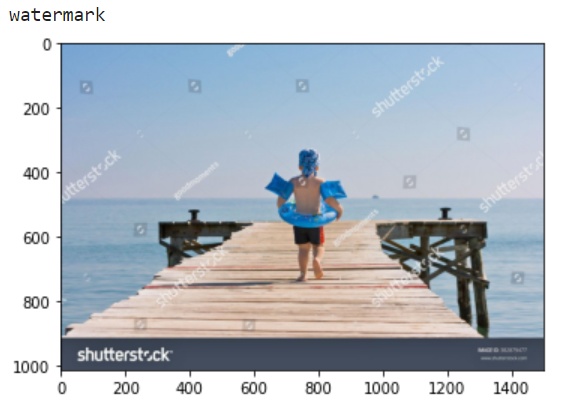

# watermark-detection

## Installation

```bash
git clone https://github.com/boomb0om/watermark-detection
cd watermark-detection
pip install -r requirements.txt
```

Model weights are automatically downloaded when you create model with `get_watermarks_detection_model`.
Also you can find them on [huggingface](https://huggingface.co/boomb0om/dataset-filters)

## Basic usage

Checkout [notebook](usage_example.ipynb) with usage example.

```python
from PIL import Image
import numpy as np
import matplotlib.pyplot as plt
import torch
from wdetector import get_watermarks_detection_model, predict_image

device = torch.device('cuda:0')

# create model
model = get_watermarks_detection_model(
    'resnext101_32x8d-large', # or 'resnext50_32x4d-small'
    device=device,
    cache_dir='weights/'
)

# open an image
img = Image.open('images/watermark/3.jpg')
# predict
res = predict_image(img, model, device)

# show result
print('watermark' if res==1 else 'clear')
plt.imshow(np.array(img))
plt.show()
```


Use WatermarksPredictor class

```python
from PIL import Image
import numpy as np
import matplotlib.pyplot as plt
from glob import glob
import torch
from wdetector import get_watermarks_detection_model, predict_image, WatermarksPredictor

device = torch.device('cuda:0')

# create model
model = get_watermarks_detection_model(
    'resnext101_32x8d-large', # or 'resnext50_32x4d-small'
    device=device,
    cache_dir='weights/'
)

# gather paths to images
paths = glob('images/*/*.jpg')

# init predictor
predictor = WatermarksPredictor(
    model, device, verbose=True
)

# predict
results = predictor.run(paths)

# show results
f, ax = plt.subplots(2,4, figsize=(16,12))
for i, (path, pred_label) in enumerate(zip(paths, results)):
    ax[i//4, i%4].imshow(plt.imread(path))
    ax[i//4, i%4].set_title('watermark' if pred_label == 1 else 'clear')
```

